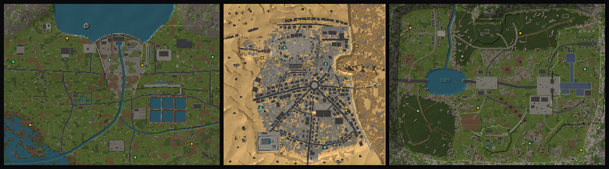

# DarkRaiders

> **An unofficial parody of *ARC Raiders*.** Not affiliated with, endorsed by or sponsored by Embark Studios.

A gritty-but-silly, pixel-voxel **top-down 2.5D extraction roguelite** for the browser that lovingly roasts
*ARC Raiders* and extraction shooters in general. It's rendered like an "ultra-powerful SNES": low-resolution
3D voxels in an oblique 3/4 view, 15-bit colour with ordered dithering, dynamic lights and shadows, weather
and time of day.

The **ARK** (*Autonomous Repossession Konglomerate – the K was a branding decision*) have come to repossess the
planet, and humanity is three payments behind. From the underground town of **Desperanza** you go topside, loot
anything that isn't nailed down, dodge the repo machines and **extract – or lose everything but your safe pocket.**



## Run it

No build step. Serve the folder with any static web server and open `index.html`:

```bash
npx http-server -p 8080 .        # or: python3 -m http.server 8080
# then open http://localhost:8080
```

(ES modules don't load from `file://`, so a server is required. Any static host works, e.g. GitHub Pages.)

## Controls

| Action | Key |
|---|---|
| Move / aim | `WASD` / mouse |
| Fire / aim down sights | `LMB` / `RMB` |
| Sprint / crouch / dodge-roll | `Shift` / `C` (toggle) / `Space` |
| Reload / swap weapon / swing the Hatchet Job (your axe) | `R` / `Q` or wheel / `V` |
| Interact (hold to search, revive, call elevators) | `E` |
| Quick-use slots / throw grenade | `1`–`6` / `G` |
| Flashlight | `F` |
| Inventory / map | `Tab` / `M` |
| Ping / "Don't shoot!" emote (works 12% of the time, every time) | `Z` or middle mouse / `H` |
| Squad chat | `Enter` |
| Pause & settings (and *I'm stuck – call a tow* if you ever get wedged somewhere) | `Esc` |
| FPS counter | `F3` |

Gamepads work too (twin-stick: left stick move, right stick aim, triggers ADS/fire), and phones get optional
touch controls. On a phone, "Add to Home Screen" runs it full-screen without browser bars.

## What's in it

* **Three original maps** at 25–30-minute raid scale, each with its own design note in [`docs/maps/`](docs/maps):
  * **Dam Grounds** (1100×825 m): a hydroelectric utility that defaulted on its loans. Its dam, the Debt Ceiling,
    holds back the Overdue Reservoir; below it a 12 m gorge with the Hamster Wheel powerhouse and the Bridge To Nowhere;
    staff housing, the Ivory Tower and the Paywall up on the plateaus; the Red Ink Lakes and Subprime Trailer
    Park down in the lowlands.
  * **Sandy City** (900×900 m): a seaside resort that went bust twice – first the sea left, then the sand
    arrived. Boulevards fan out from the Roundabout of Regret; there's St. Copay's Hospital, the Overdue
    Library, the Pump & Dump Gas Station, a marina full of stranded boats at Yacht Rock Bottom, and an old town
    on the hill with Our Lady of Perpetual Escrow.
  * **Green Gate** (1100×825 m): a mountain valley run by the Gatekeeping Department. The highway crosses Lake
    Liquidity on a causeway that fell in during Infrastructure Week, queues at the Toll Booth of Eternal Hold
    Music, and ends at a gate jammed two-thirds shut; behind it, Tunnel Vision leads under the Shelf to the
    Cloud (Basement).

  Buildings have real upper floors, stairs, ladders and walkable roofs; there are towers, bridges you can walk
  on and under, underground halls and metro stations, ~600–850 containers and 120+ ARK groups per map, rooftop
  snipers and condition-only bosses.
* **Extraction**: hold E at the call point (the alarm draws nearby ARK), hold out through a 40 s countdown, get
  in when the doors open and pull the departure lever (or it leaves by itself after 90 s), then survive the
  8 s door close. Cargo elevators play **40 seconds of elevator music** while you wait. Metro trains in
  underground stations (each works once per raid), dropships over Green Gate's airshafts, and key-locked
  **Doggy Doors** with a silent 15 s window. Downed raiders bleed out over 60 s – just enough to crawl to an
  extraction, call it and ride out. ARK ignore downed raiders; hostile raiders don't. A raid goes to overtime
  while an extraction is underway.
* **Map conditions**: Night Shift, Electric Boogaloo (lightning), Cold Shoulder, Bad Hair Day, Allergy Season,
  Everything Must Go, Mass Layoffs, Survey Season, Audit Season, Magpie Mafia, Forgot My Password, and the
  boss events Juice Cleanse (The Landlady) and Mom's Home (Helicopter Mom) – plus random time of day and
  weather (rain, storms, fog, sandstorms, snow).
* **21 ARK repo machines** – the Late Fee that latches onto your face, the Pop-Up Ad that rolls up beeping,
  Buzzkill drones, the shield-draining Middle Manager, the Narc that calls its friends, the Plus One that
  marks you for its Shell Company, Neighborhood Watch snipers, the Close Talker, Rocket Surgeons, the Vape
  Lord, Parkour Dad, the HOA President, the Cloud Service that crashes mid-raid, The Landlady and Helicopter
  Mom – with top-down weak points: shoot rotors off drones, flank armoured fronts, crack rear canisters to
  expose cores, break Parkour Dad's knees. They hit about half as hard as the machines they parody, and shots
  at them get generous aim assist (a near miss is bent onto the body, at the right height for hovering drones).
  **ARK vision cones are real light** – a spotlight traced against walls, trees, rocks and terrain, whose
  colour follows the machine's mood: cool white while patrolling, yellow → orange when suspicious, red once it
  has spotted you. Edge-of-screen chevrons warn of nearby machines.
* **The Hatchet Job**: every raider carries an axe that can't be lost. Run dry with no reserve ammo (or break your
  gun) and it comes out on the fire button; `V` swings it any time.
* **Bot raider squads** with mixed temperament: some hunt you, others shout *"DON'T SHOOT!"* and keep their
  distance – until someone uses up the 12%.
* **488 items**: 24 weapons with tiers I–IV and mods (the Teapot, the Maraca, the Cha-Cha-Cha burst rifle, the
  BOGO pistol that fires two for the price of one, the Hair Dryer energy shotgun, the Hostile Takeover beam
  rifle…), Hoarder / Gym Bro / Overthinker augments, shields, healing, grenades, traps, gadgets, ARK parts,
  materials, valuables (you will carry 40 Rusted Gears), keys and 82 blueprints.
* **Desperanza**: stash & loadout; workshop benches (the Wobbly Table, Gun Garage, Sewing Circle, Medicine
  Cabinet, Bad Idea Bench, Junk Drawer and The Upcycler) that unlock higher-tier recipes; Nugget, the Workshop
  Rooster & Union Rep; five traders – Auntie Synergy (Raider Leader, Self-Appointed), Sergeant Shaky (Head of
  Security and Conspiracies), Wen Ever (Gunsmith, Eventually), Kaboomer (Travelling Mechanic & Unlicensed
  Flautist) and Doc Reboot (Field Medic, Warranty Expired); 78 quests, starting with *Picking Up The Bits
  (Again) (Forever)*; and a skill tree – Dad Strength, Cardio and Gremlin Mode – whose capstones are
  deliberately overpowered.
* **Co-op for up to 4** over WebRTC (PeerJS). The host's browser runs the raid; everyone else joins with a
  5-letter invite code, spawns together, and returns to the same squad lobby after extracting. In-game text chat
  and pings included.
* **Synthesised SNES-style soundtrack and SFX** (Web Audio, no audio files), including the elevator's
  bossa-nova hold music, *Please Hold*.

## Saves

Progress (stash, loadout, workshop, blueprints, skills, quests) saves automatically to browser storage and is
mirrored into cookies. Use **Raider → Save / Load** in the hub to export your save as a `.json` file and import
it on another browser or machine.

## Co-op notes

* Hosting uses the free public PeerJS signalling server. If it is down or blocked on your network you can point
  the game at your own [PeerJS server](https://github.com/peers/peerjs-server):
  `index.html?peerhost=my.server&peerport=443&peerpath=/myapp`.
* Very strict NATs may need a TURN server; most home connections work out of the box.
* For same-machine testing, `?net=local` uses a BroadcastChannel transport between browser tabs.

## Development

* `index.html?raid=test_range` jumps straight into the developer sandbox map (`&time=night&weather=rain&cond=em_storm`).
* `index.html?dev` adds the sandbox to the lobby map list.
* `tools/mapview.html?map=<id>&mode=overview` previews whole maps with markers; `mode=view&x=..&z=..` shows the
  in-game camera.
* `tools/arkgallery.html` (every ARK model, `?state=idle|alert|fire|broken|demo`), `tools/icons.html` (all item
  icons + gun models), `tools/audio-test.html` (every sound, music state and jingle, including the elevator
  muzak) and `tools/hubtest.html` (the Desperanza hub on its own).
* `tools/*.mjs` are headless Playwright test scripts (playtest, menu flow, co-op, gameplay loop, flight and
  pathfinding); `node tools/mapthumbs.mjs` regenerates the lobby map previews in `assets/maps/` after map edits.
* Architecture, content schemas and the naming/writing policy: [`docs/ARCHITECTURE.md`](docs/ARCHITECTURE.md);
  map-building guide: [`docs/MAPS.md`](docs/MAPS.md).

## Parody notice

DarkRaiders is an unofficial parody. It is not affiliated with, endorsed by or sponsored by Embark Studios AB.
*ARC Raiders* is a trademark of Embark Studios AB and is named here only to identify the game being parodied.
The maps, art, audio, code and writing in this repository are original to this project.

Three.js (MIT) and PeerJS (MIT) are vendored in `vendor/`. Pixel fonts derived from the public-domain X11 misc
bitmap fonts.
