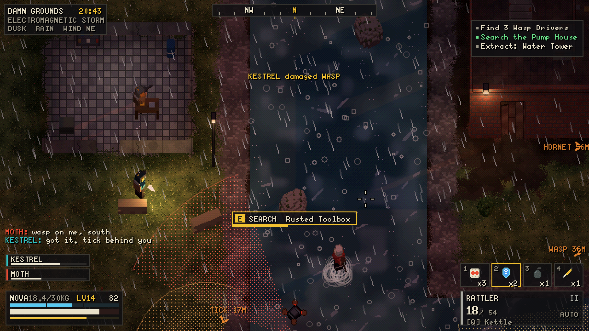

# DarkRaiders

A gritty, pixel-voxel **top-down 2.5D extraction roguelite** for the browser, patterned after
*ARC Raiders* and rendered like an "ultra-powerful SNES": low-resolution 3D voxels in an oblique
3/4 view, 15-bit colour with ordered dithering, dynamic lights and shadows, weather and time of day.

Raid the surface, dodge the ARK, loot, and **extract — or lose everything but your safe pocket.**



## Run it

No build step. Serve the folder with any static web server and open `index.html`:

```bash
npx http-server -p 8080 .        # or: python3 -m http.server 8080
# then open http://localhost:8080
```

(ES modules don't load from `file://`, so a server is required. Any static host works — e.g. GitHub Pages
pointed at this branch.)

## Controls

| Action | Key |
|---|---|
| Move / aim | `WASD` / mouse |
| Fire / aim down sights | `LMB` / `RMB` |
| Sprint / crouch / dodge-roll | `Shift` / `C` (toggle) / `Space` |
| Reload / swap weapon / melee | `R` / `Q` or wheel / `V` |
| Interact (hold to search, revive, call elevators) | `E` |
| Quick-use slots / throw grenade | `1`–`6` / `G` |
| Flashlight | `F` |
| Inventory / map | `Tab` / `M` |
| Ping / "Don't shoot!" emote | `Z` or middle mouse / `H` |
| Squad chat | `Enter` |
| Pause & settings | `Esc` |
| FPS counter | `F3` |

Gamepads work too (twin-stick: left stick move, right stick aim, triggers ADS/fire).

## What's in it

* **Three maps** traced from the real game's layouts: **Dam Grounds** (Dam Battlegrounds, 1100×825 m),
  **Green Gate** (The Blue Gate, 1100×825 m) and **Sandy City** (Buried City, 900×900 m), at near-real scale
  for 25–30 minute raids – POIs at their reference positions and angles, key rooms, cargo elevators,
  airshafts, metro stations, raider hatches, field depots, ~700–850 containers and 100+ ARK groups each,
  with rooftop Sentinels and condition-only bosses (Harvester Queene, Matriark). Buildings have real
  upper floors, stairs, ladders and walkable roofs; towers, catwalks, bridges you can walk on and under,
  and underground tunnels and metro halls beneath the streets.
* **Extraction like the real game**: hold E at the call point (the alarm draws nearby ARK), hold out
  through a 40 s countdown, get in when the doors open and pull the departure lever (or it leaves by
  itself after 90 s), then survive the 8 s door close. Downed raiders bleed out over 60 s (longer with
  downed-health skills): just enough to crawl to an extraction, call it and ride out. ARC ignore downed
  raiders; hostile raiders don't. Concrete cargo-elevator bunkers, metro trains in
  their underground stations (each station works once per raid), dropships over Green Gate's airshafts,
  and key-locked Raider Hatches with a silent 15 s window. A raid goes to overtime while an extraction is
  underway.
* **Map conditions**: Night Raid, Electromagnetic Storm (lightning strikes), Cold Snap, Hurricane,
  Lush Blooms, Uncovered Caches, Husk Graveyard, Prospecting Probes, Harvester/Matriarch bosses, Close
  Scrutiny, Locked Gate… plus random time of day and weather (rain, storms, fog, sandstorms, snow).
* **21 ARK machines** (Wazp, Hornett, Tikk, Popp, Fyreball, Snytch, Spottr, Turrett, Sentinal, Surveyr,
  Rocketier, Leapr, Bastian, Bombardeer, Queene, Matriark…) with top-down weak points: shoot rotors off
  drones, flank armoured fronts, crack rear canisters to expose cores, break Leapr legs.
  **ARK vision cones are real light** – a spotlight traced against walls, trees, rocks and terrain, with
  soft side outlines that fade out with the light. Its colour follows the machine's awareness like in
  ARC Raiders: cool white while patrolling, yellow → orange when suspicious or searching, red once it has
  spotted a raider and is attacking. Cones from off-screen ARK still reach into view, and edge-of-screen
  chevrons warn of nearby machines.
* **Bot raider squads** with mixed temperament: some hunt you, others shout *"DON'T SHOOT!"* and keep
  their distance – until someone opens fire.
* **488 items**: 24 weapons with tiers I–IV and mods, augments, shields, healing, grenades, traps,
  gadgets, ARK parts, materials, valuables, keys and 82 blueprints (powerful weapon blueprints drop
  more often than in the real game).
* **Speranzia hub**: stash & loadout, workshop benches (Gunsmith, Gear Bench, Medical Lab, Explosives
  Station, Utility Station, Refiner) that unlock higher-tier recipes, Scrappie the rooster, traders,
  78 quests, and a 3-branch skill tree whose capstones are deliberately overpowered.
* **Co-op for up to 4** over WebRTC (PeerJS). The host's browser runs the raid; everyone else joins with
  a 5-letter invite code, spawns together, and returns to the same squad lobby after extracting.
  In-game text chat and pings included.
* **Synthesised SNES-style soundtrack and SFX** (Web Audio, no audio files).

## Saves

Progress (stash, loadout, workshop, blueprints, skills, quests) saves automatically to browser storage
and is mirrored into cookies. Use **Raider → Save / Load** in the hub to export your save as a `.json`
file and import it on another browser or machine.

## Co-op notes

* Hosting uses the free public PeerJS signalling server. If it is down or blocked on your network you
  can point the game at your own [PeerJS server](https://github.com/peers/peerjs-server):
  `index.html?peerhost=my.server&peerport=443&peerpath=/myapp`.
* Very strict NATs may need a TURN server; most home connections work out of the box.
* For same-machine testing, `?net=local` uses a BroadcastChannel transport between browser tabs.

## Development

* `index.html?raid=test_range` jumps straight into the developer sandbox map (`&time=night&weather=rain&cond=em_storm`).
* `index.html?dev` adds the sandbox to the lobby map list.
* `tools/mapview.html?map=<id>&mode=overview` previews whole maps with markers; `mode=view&x=..&z=..` shows the in-game camera.
* `tools/arkgallery.html` (every ARK model, `?state=idle|alert|fire|broken|demo`), `tools/icons.html` (all item
  icons + gun models), `tools/audio-test.html` (every sound, music state and jingle) and `tools/hubtest.html`
  (the Speranzia hub on its own).
* `tools/*.mjs` are headless Playwright test scripts (playtest, menu flow, co-op, gameplay loop);
  `node tools/mapthumbs.mjs` regenerates the lobby map previews in `assets/maps/` after map edits.
* Architecture and content schemas: [`docs/ARCHITECTURE.md`](docs/ARCHITECTURE.md); map-building guide: [`docs/MAPS.md`](docs/MAPS.md).

Fan project. ARC Raiders is a trademark of Embark Studios AB; DarkRaiders is not affiliated with or endorsed by Embark.
Three.js (MIT) and PeerJS (MIT) are vendored in `vendor/`. Pixel fonts derived from the public-domain X11 misc bitmap fonts.
